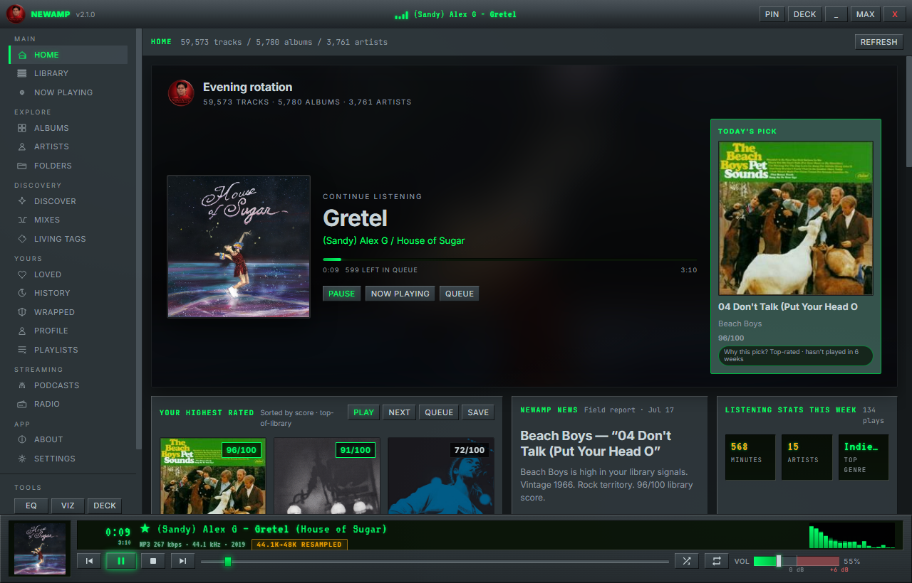
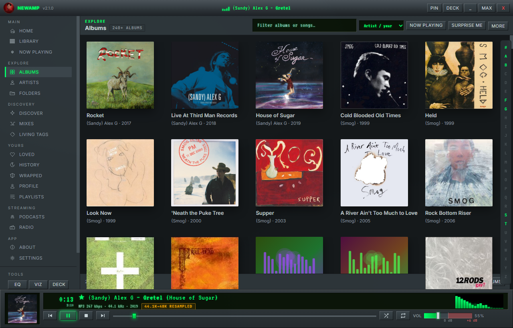
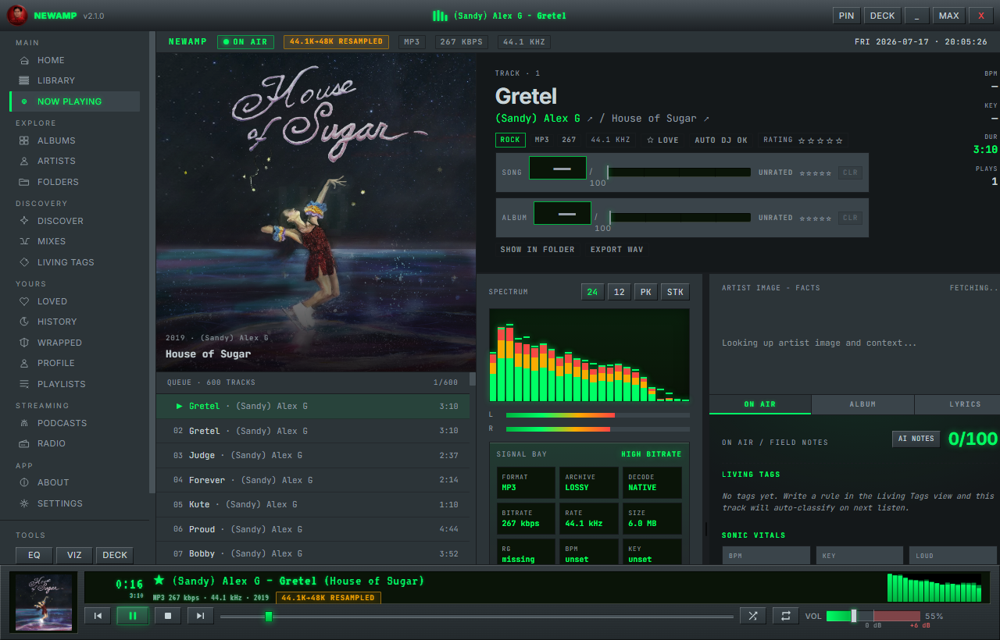
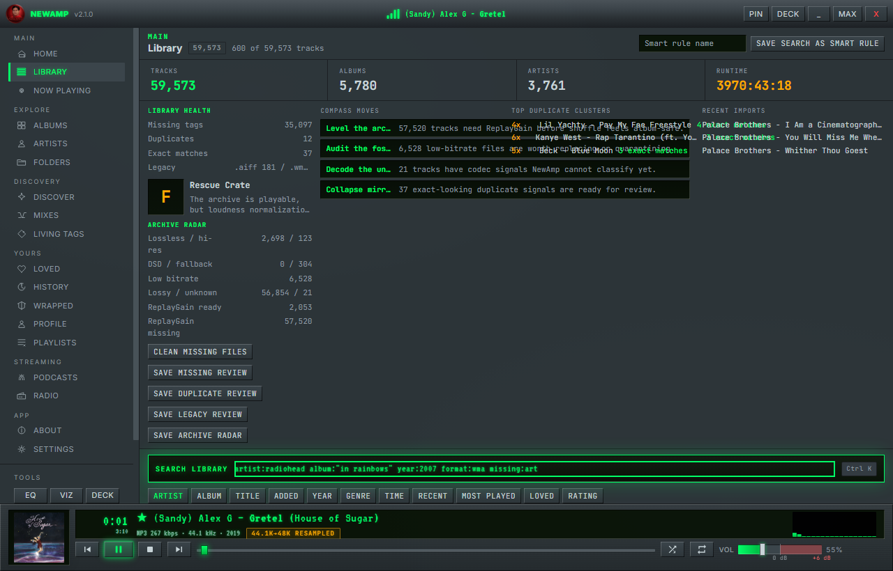
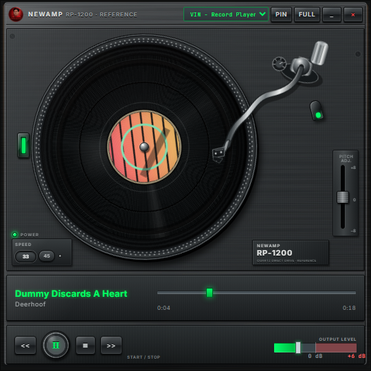
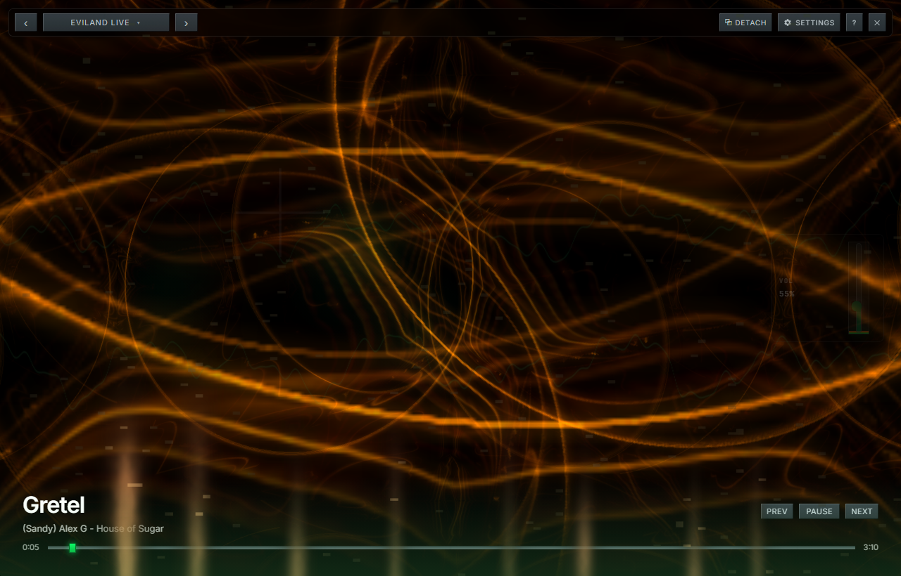

<div align="center">


# NewAmp

**A music player for files you already own.**

Windows, macOS, and Linux. Free and open source.

[](https://github.com/evilander/newamp/releases/latest)
[](LICENSE)

</div>

---

## What it is

Point NewAmp at a folder of music and it builds a library, plays it, and remembers
what you listened to. There's no account, no subscription, and nothing is uploaded
anywhere — mostly because there's no server to upload it to.

I built it because I still keep music on a hard drive and wanted a player that
treats that as normal.

## Download

Grab your platform from the [latest release](https://github.com/evilander/newamp/releases/latest):

| Platform | File |
| --- | --- |
| Windows | `NewAmp Setup <version>.exe`, or `NewAmp Portable <version>.exe` if you'd rather not install |
| macOS | `NewAmp <version> arm64.dmg` (Apple Silicon) or `x64.dmg` (Intel) |
| Linux | `NewAmp Linux <version> x64.tar.gz` — extract and run `./newamp` |

The builds aren't code-signed, so Windows SmartScreen will want "More info → Run
anyway", and macOS will want a right-click → Open the first time. Checksums for
every file are in `SHA256SUMS.txt`.

## What it does

- Plays MP3, FLAC, OGG, Opus, WAV, M4A, AAC, WMA, AIFF, APE, WV, DSF and a few
  others.
- Handles large libraries. Mine is about 60,000 tracks.
- Winamp-style keyboard control: space, arrows, `L` to love, `0`–`5` to rate,
  `Q` to queue, `F` for fullscreen visuals, `Ctrl+K` for search.
- Visualizers — real MilkDrop presets through Butterchurn, plus Eviland, my own
  engine that reacts to separate frequency bands instead of one lumped envelope.
- Skins, including imported Winamp 2.x `.wsz` files, and compact "deck" modes
  that shrink the window into something resembling a physical device.
- Smart playlists, an Auto DJ, ratings, and a search language
  (`loved AND bpm > 120 AND not played this month`).
- Synced lyrics, podcasts, CUE sheets, and Last.fm scrobbling if you set it up.
- A year-in-review built from your own play history, since nobody else has it.
- A phone remote over your own Wi-Fi, via a QR code.

## A look at it

| Home | Albums |
| --- | --- |
|  |  |

| Now Playing | Library |
| --- | --- |
|  |  |

| Record player deck | Eviland visualizer |
| --- | --- |
|  |  |

More in `assets/screenshots/`.

## First run

1. Open it. It'll offer to scan your Music folder, or you can drop any folder on
   the window.
2. Scanning takes roughly ten seconds per thousand tracks.
3. `Ctrl+K` searches. `F` goes fullscreen. `Ctrl+M` shrinks it to a deck.
4. Settings → Shell and Settings → Skin change how it looks.

## Size, memory, and Electron

This comes up a lot, and it's a fair criticism, so here are the real numbers
instead of a defense.

NewAmp is an Electron app. The Windows installer is about **98 MB** and unpacks to
**368 MB**. Winamp 5.9 was around 12 MB. That gap is real and I can't close it.
Of the unpacked size, 216 MB is Chromium itself and 79 MB is the bundled ffmpeg
binary that handles decoding and transcoding. Roughly 30 MB is actually NewAmp.

Memory is heavier than a native player too. With my 60,000-track library it sits
around 400 MB in the main process, and Task Manager will show something like
800 MB across all of its processes.

I did recently cut 122 MB of genuine waste out of the build — duplicate copies of
libraries that were already bundled, 54 languages of Chromium locale files the app
never uses, and a DirectX shader compiler only WebGPU needs. That was my sloppiness,
not Electron's, and it's fixed. Shrinking the bundled ffmpeg is the next real target.

But the honest summary is: if a small, native, low-memory player is what you want,
NewAmp is not it, and foobar2000 or Winamp itself will serve you better. Electron is
what let one person actually build and ship this across three platforms, and the
visualizer stack is WebGL, which is a genuinely good fit for the browser engine.
That's the trade I made, with my eyes open.

## Privacy

- No telemetry, no analytics, no crash reporting that leaves your machine, no
  update pings.
- The only network calls are ones attached to a feature you can see, and all are
  optional: lyric lookups (LRCLIB), cover art and metadata repair (MusicBrainz /
  Cover Art Archive), podcast feeds you added, and Last.fm scrobbling with your
  own credentials.
- The phone remote binds to your local network and requires a token unique to
  your install.
- Your library is a SQLite file in your OS profile (`%APPDATA%/NewAmp`,
  `~/Library/Application Support/NewAmp`, or `~/.config/NewAmp`). Delete that
  folder and there's no trace left.

## Build from source

Node 20 or newer:

```bash
git clone https://github.com/evilander/newamp.git
cd newamp
npm install
npm run dev       # hot reload
npm run package   # build installers for your platform
```

The stack is Electron, Vite, React, Zustand, and sql.js for the library, with
music-metadata for tags and ffmpeg for decoding. `docs/features.md` has the full
feature list and `docs/audio-quality.md` explains the audio path, including what
the bit-perfect and resample badges actually mean.

## Contributing

Bug reports and ideas are welcome — [open an issue](https://github.com/evilander/newamp/issues).
[CONTRIBUTING.md](CONTRIBUTING.md) has the details, but you don't need to run the
full test suite to fix a typo.

## License

[MIT](LICENSE). The NewAmp name and logo are mine; the code is yours to do
whatever you like with.
