<div align="center">

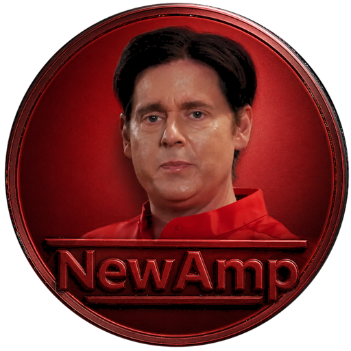

# NewAmp

**A Winamp-inspired modern desktop music player for Windows and Linux.**
**Your local library. Your rules. No streaming. No cloud. No telemetry.**

[](https://github.com/evilander/newamp/releases)
[](LICENSE)
[](https://github.com/evilander/newamp/releases)
[](https://www.electronjs.org/)

</div>

---

## What it is

NewAmp is a local-first Windows and Linux music player for people who actually own their music. It indexes a local folder of MP3 / FLAC / OGG / Opus / WAV / M4A / AAC / WMA / AIFF / APE / WV / MPC / DSF / DFF and gives you a player that feels like a piece of hardware, not a subscription dashboard.

It scales to **tens of thousands of tracks** (tested at 60k+), runs entirely on your machine, and never phones home.

## 30-second pitch

- **Four UI shells** — Retro (Bloomberg-density Winamp 2 homage), Modern (rounded, content-forward), Liquid Glass (translucent stacked panes with backdrop-filter), Concourse (operator-console split-cells)
- **Nine deck (compact-window) skins** - Windowshade, Winamp Classic, Winamp Industrial, Record Player, Jukebox, Cassette Deck, Discman, Hotdog Deck, and Retro TV. Each declares its own native window size with no letterbox
- **13 color skins** — Classic, Ops, Midnight, Neon, Amber, Oxide, Steel, Walnut, Jukebox, Terminal, Ice, Miami, Mono. Plus full Winamp 2.x `.wsz` skin import
- **0–100 decimal track scoring** — Drag, scroll-wheel, keyboard-nudge, or double-click to type `88.3`. Stars stay in sync for legacy sorts and smart rules
- **0–200% volume** with a red-zone past unity — VLC-style amp boost, full `0 dB / +6 dB` tick labels, runs after the master limiter so it amplifies without clipping
- **Magazine-style Home** — greeting hero with blurred album backdrop, Today's Pick (high-rated track you haven't played in 6+ weeks, with a reason chip), Your Highest Rated rail, NewAmp News editorial card, Listening Stats This Week, plus the classic Harmonic / Taste / Loved / Heavy Rotation / Fresh Imports rails
- **Living Library Discover mode** — local-first crate-digging missions that turn ratings, plays, skips, fresh imports, deep album candidates, and underplayed corners into playable sessions with Deck / Full Vis / Save as Playlist actions
- **Audio DNA + Sounds Like** — per-track perceptual fingerprints (brightness, dynamic range, band energies, onset density, etc.) extracted via local FFT, surfaced as a cosine-similarity "Sounds Like" panel on Now Playing
- **Living Tags DSL** — write expressions like `tag(midnight_drive) when bpm > 110 and dna.energy > 0.4 and genre matches "synth|wave" boost 1.5` and the library reactively re-tags itself. Tags compose, cycle-check at definition time, and become first-class power-search filters (`tag:midnight_drive`). No music player has had this before
- **Library Radio Brain** — flip a toggle and your library becomes a tunable HTTP station on the local network (`http://desktop:17117/library.m3u`, `/random.m3u`, `/tag/<name>.m3u`, `/audio/<id>`). VLC on your phone, OBS, Sonos URL import — anything that consumes M3U works
- **Spectral Cover Art** — albums without real art render a stable, unique procedural SVG cover seeded by `artist::album`, so your collection looks intentional instead of placeholder-grey
- **Bloomberg-density Now Playing** with a tabbed side panel (On Air / Album / Lyrics), draggable spectrum-split, selectable spectrum styles, VU + waveform overview, LRCLIB-synced lyrics, optional karaoke mode, custom-lyrics editor, tempo trainer, practice A/B loop, track bookmarks
- **Milkdrop visualizer + 17 in-house fullscreen modes** — Butterchurn presets plus beat-locked Tempo Pulse, club-strobe Lattice, neon waves/ribbons, plasma grid, prism bars, burning cloud, aurora, orbital rings and the rest. Real spectral-flux beat detection drives the visuals; an auto hardware tier picks balanced/low so older machines don't lurch
- **Auto DJ + smart playlists** — BPM/key-aware harmonic mixes, taste-learning from plays/loves/ratings/skips, smart rules with min-rating filters
- **Album art rescue + Metadata rescue** — embedded art, folder art, Cover Art Archive, MusicBrainz lookup, and manual cleanup tools for rough local libraries
- **Artist facts and images** — musician-first artist context and large artist images without confusing bands for species, cities, albums, or other same-name pages
- **Custom playlists** — create named playlists, reorder tracks, export portable folders, and pick or drop playlist artwork for the playlist icon
- **Native guitar tab companion** — cache local/Ultimate Guitar-style tabs and pop out a native tab window when a playable match exists
- **Audiophile chain** - WASAPI on Windows, Chromium system audio on Linux, ReplayGain (per-track + per-album), crossfade/gapless playback checks, software limiter, 10-band EQ, lossless WAV export of any track, output-device picker with test tone where the OS exposes it
- **CUE sheet playback** — one-file albums split into playable, seekable tracks with performer/title/year/genre metadata
- **Last.fm** — full scrobbling + now-playing + offline outbox queue
- **Local-first** — SQLite library, sql.js, no account, no telemetry, no required network

## Screenshots

### Daily-driver views

| Home | Albums |
| --- | --- |
| 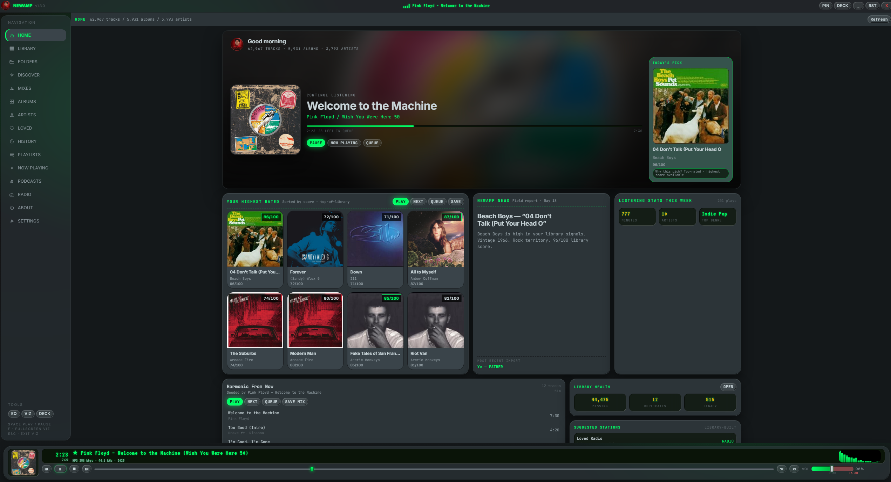 | 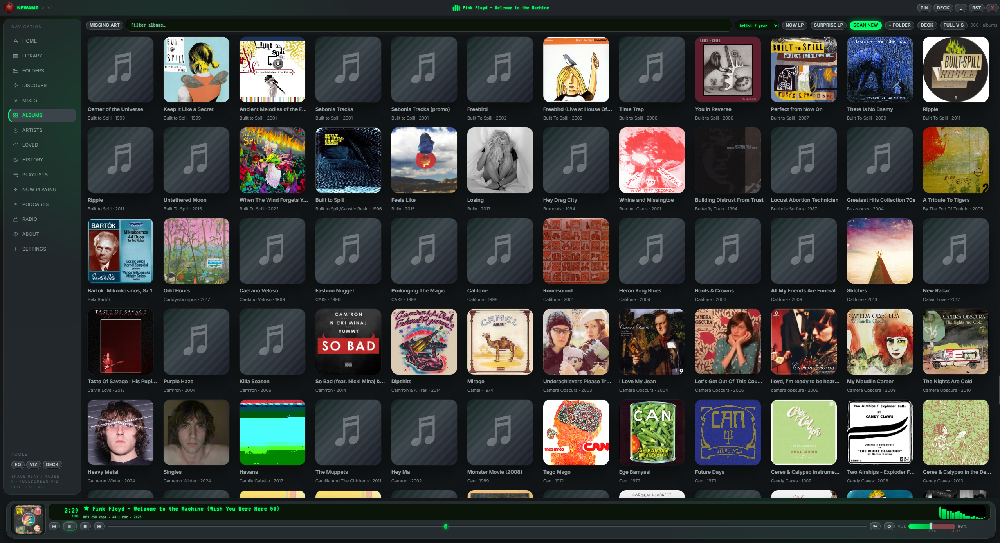 |

### Now Playing

| On Air — facts + spectrum | Lyrics |
| --- | --- |
| 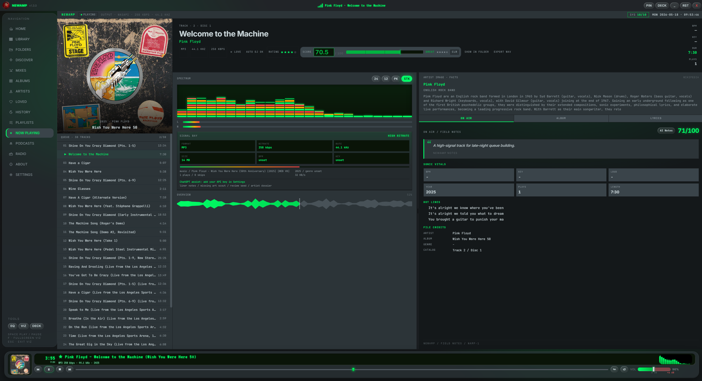 | 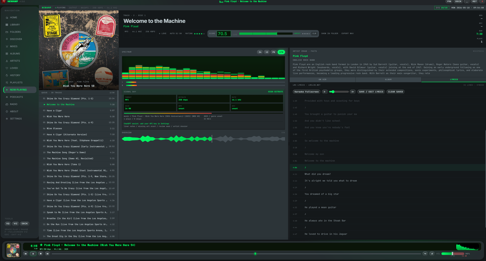 |

### Shape-changing decks

Nine compact-window skins, each declaring its own native window size so the OS chrome stays out of the way.

| Record Player | Jukebox |
| --- | --- |
| 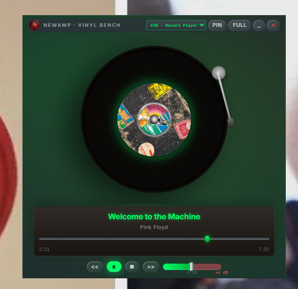 | 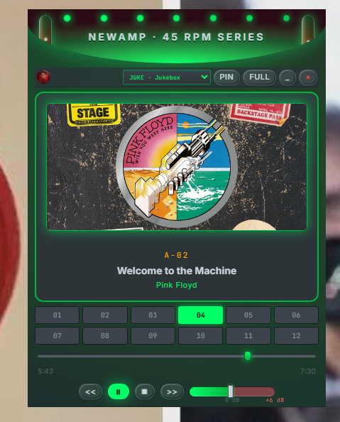 |

| Hotdog | Windowshade (classic) |
| --- | --- |
| 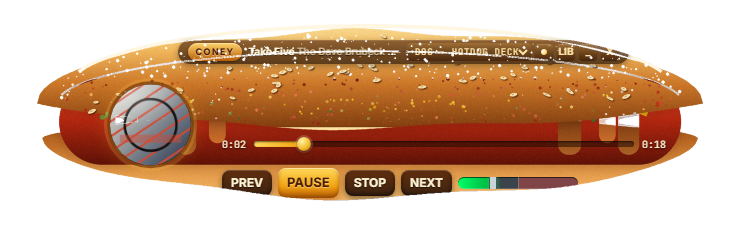 | 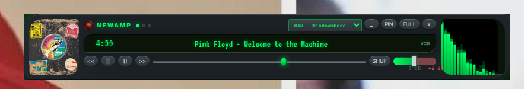 |

### Reactive tagging + sonic cartography

| Living Tags workshop | Sonic Atlas |
| --- | --- |
| 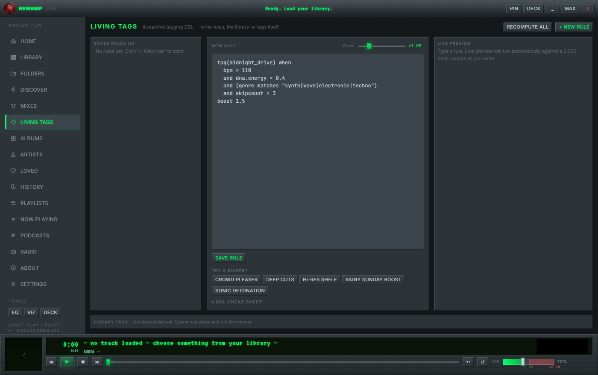 | 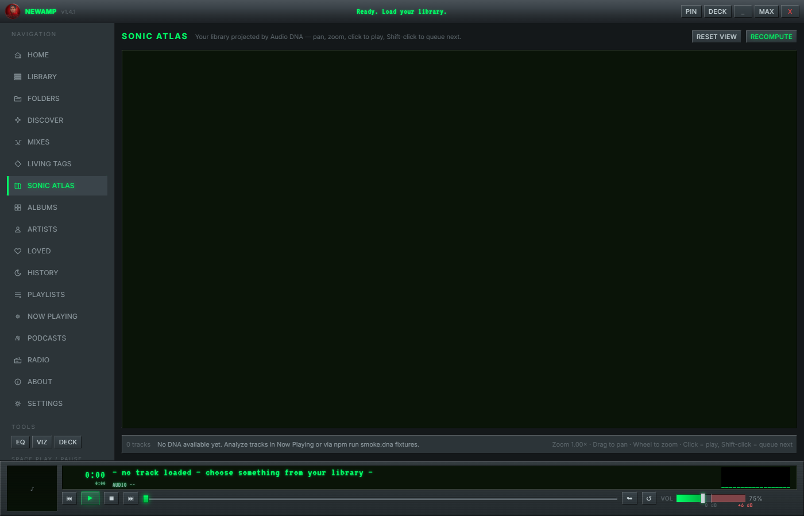 |

### Visualizers

| Tempo Pulse | Aurora |
| --- | --- |
| 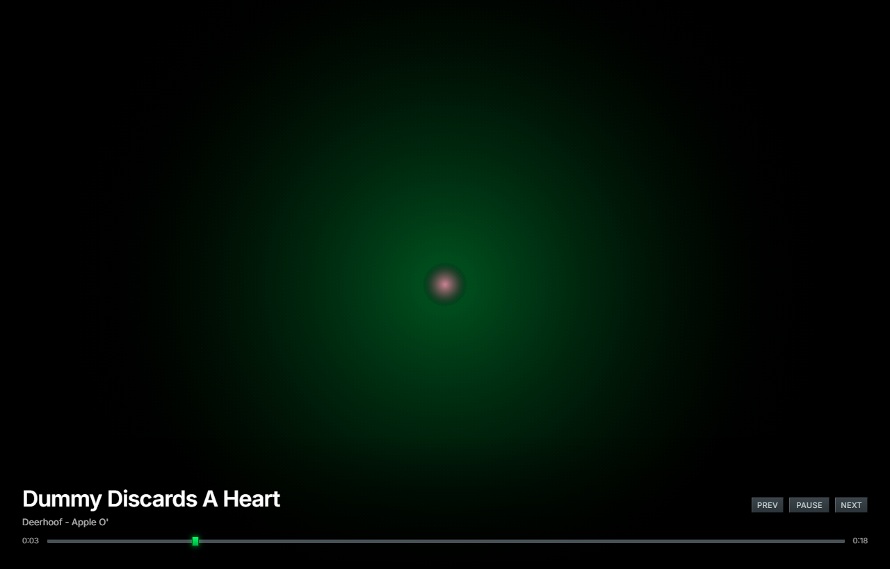 | 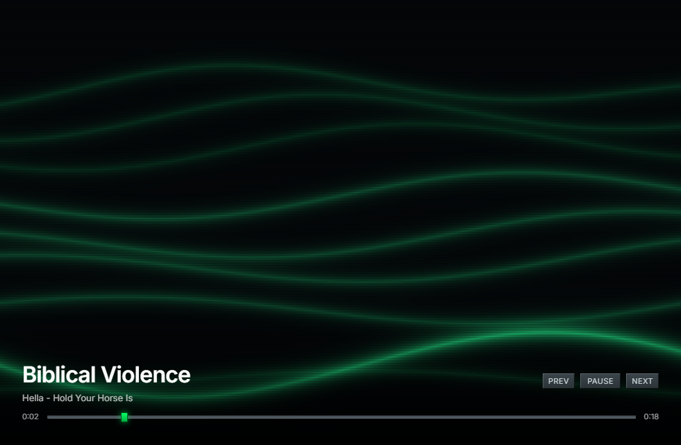 |

| Lattice Strobe | Spectrum |
| --- | --- |
| 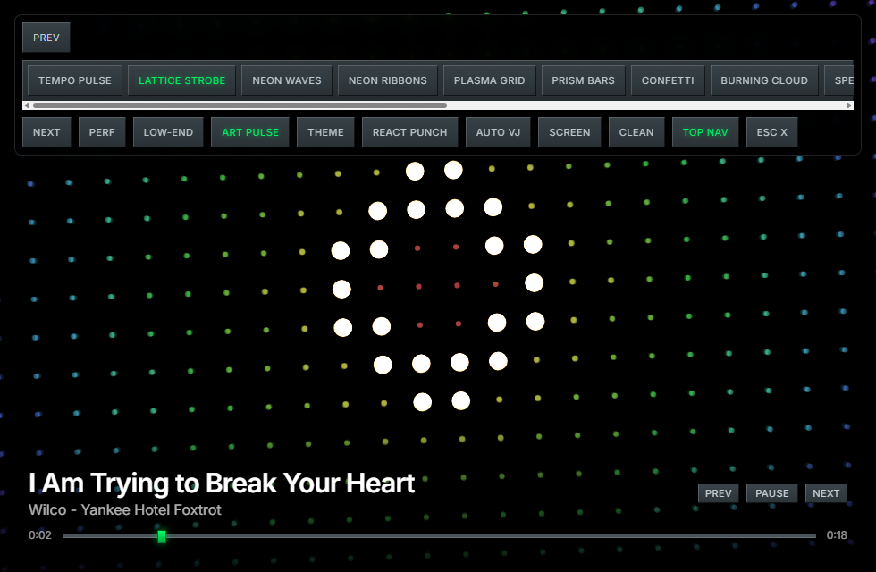 | 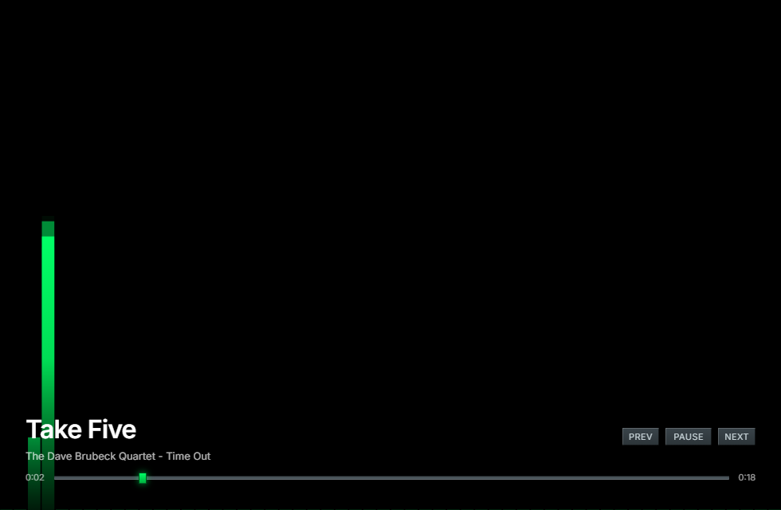 |

### Library polish

| Spectral Cover Art | Grouped sidebar nav |
| --- | --- |
| 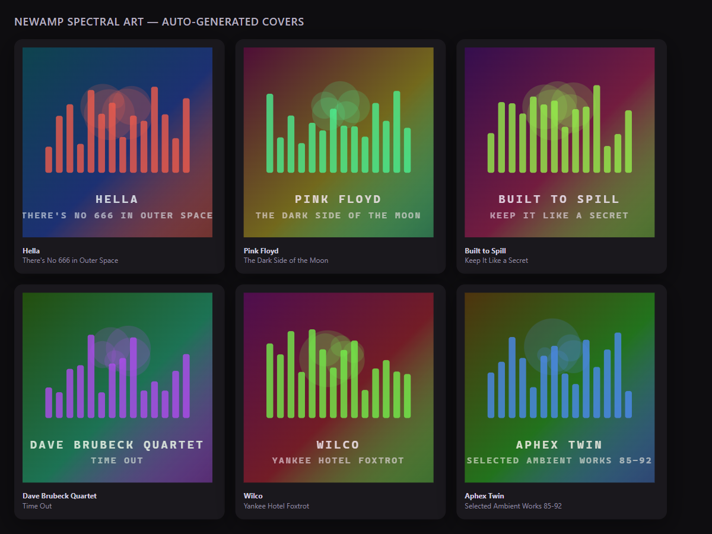 | 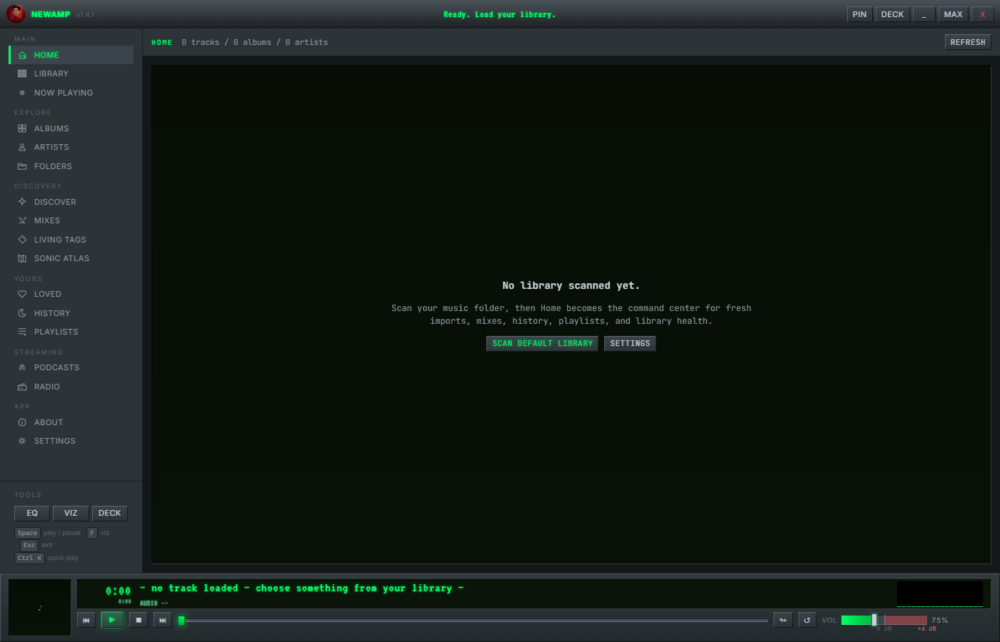 |

Additional contributed deck and library captures live in `assets/screenshots/`.

## Install

Grab the latest from [**Releases**](https://github.com/evilander/newamp/releases):

- **`NewAmp Setup 1.4.0.exe`** - Windows NSIS installer, registers file associations for 20 audio formats + 4 playlist formats
- **`NewAmp Portable 1.4.0.exe`** - Windows single-file portable, no install, no registry writes
- **`NewAmp Linux 1.4.0 x64.tar.gz`** - Linux portable build. Extract it and run `./newamp`

All artifacts are listed with SHA256 hashes in `SHA256SUMS.txt`.

> Windows SmartScreen may warn on first launch depending on local trust state. Click "More info" -> "Run anyway", or verify against the checksum file before launching.

## First run

1. Open NewAmp.
2. Empty Library view will offer to scan your default Music folder, or pick any folder. NewAmp will also surface one-click music folder suggestions for places it finds in standard locations (`Music`, `OneDrive/Music`, etc.).
3. Wait for the initial scan to finish (~10s per thousand tracks for tag + cover-art extraction).
4. Drop a `.wsz` Winamp 2.x skin file onto the window to install it. Or open Settings → Shell · Layout to switch the chrome shell, or Settings → Skin for the color palette.
5. Open **Discover** for a Living Library session, or press **Ctrl+K** anywhere to open the command palette (search anything: tracks, albums, artists, views, commands).

## Theming

NewAmp has two independent style axes:

| Axis      | What it controls                                  | Where to change it      |
| --------- | ------------------------------------------------- | ----------------------- |
| **Shell** | Layout, sidebar, transport, glass effects         | Settings → Shell        |
| **Skin**  | Colors — accent, ink, panel, glow, scanlines, LCD | Settings → Skin         |
| **Deck**  | Compact-window shape (record / jukebox / etc.)    | Picker in the deck view |

Custom skins:

- Drop a Winamp 2.x `.wsz` file onto the window — extracted via `winamp-skin-import.ts` (palette derived from the bitmap)
- Or use the Skin Workshop inside Settings to author and export a `.newampskin.json`

## Audio

- Outputs through Web Audio's `AudioContext`. On Windows this uses the selected WASAPI device; on Linux it uses the system audio stack exposed to Chromium, typically PipeWire or PulseAudio.
- ReplayGain: tracks parsed for `replaygain_track_gain` / `replaygain_album_gain` tags. Per-track or per-album mode selectable.
- Software peak limiter sits in the chain by default and can be toggled with a single preamp dB control.
- Volume slider goes to 200% with a red-zone past unity (`+6 dB`) — like VLC. The amp runs after the limiter so over-100% boost stays clean.
- 10-band EQ with `eqEnabled` gate. Custom presets persist via settings.
- Export any track as 16-bit WAV from the Now Playing header.
- DSF and DFF files are accepted through the ffmpeg fallback path and decoded to PCM for Web Audio playback. That is DSD-file compatibility, not native/DoP bit-perfect DSD output. The Windows package includes `ffmpeg-static`; the Linux portable build falls back to system `ffmpeg` when the bundled platform binary is not present, so install `ffmpeg` or set `NEWAMP_FFMPEG_PATH` for DSD/WMA/AIFF-style fallback formats.

## Build from source

Requires Node 20+ on Windows or Linux.

```powershell
git clone https://github.com/evilander/newamp.git
cd newamp
npm install
npm run dev                  # development with hot reload
```

Build production artifacts:

```powershell
npm run package              # produces Windows installer/portable + Linux tar.gz + SHA256SUMS.txt
npm run package:installer    # NSIS only
npm run package:portable     # portable .exe only
npm run package:linux        # Linux portable tar.gz only
```

Run the full smoke suite (~80 smokes, several minutes):

```powershell
npm run release:gate:local
```

Release proof helpers:

```powershell
npm run release:start-lastfm-proof
npm run release:record-lastfm-proof -- --token=<token> --confirm-live-write
npm run release:check-lastfm-proof
npm run release:start-listening-proof
npm run release:record-listening-proof -- --confirm-playback --confirm-output-switching --confirm-crossfade --confirm-gapless
```

## Keyboard shortcuts

Winamp-style keyboard controls are available anywhere outside text fields:

| Shortcut          | Action                              |
| ----------------- | ----------------------------------- |
| Space             | Play / Pause                        |
| ← / →             | Seek ±5 s                           |
| ↑ / ↓             | Volume ±5% (clamps at 200%)         |
| Ctrl+→ / Ctrl+←   | Next / Previous track               |
| L                 | Love / unlove current track         |
| 0–5               | Set star rating                     |
| F                 | Fullscreen visualizer               |
| Ctrl+K            | Command palette                     |
| Ctrl+F            | Search                              |
| Ctrl+M            | Toggle compact deck mode            |
| Esc               | Exit fullscreen / close overlay     |

## Architecture

```text
newamp/
  electron/        Main process: IPC, protocols, library store (sql.js), scanner,
                   metadata, music-folder suggestions, ReplayGain, EQ, exports
  shared/          Types, Discover scoring, audio limiter math, keyboard shortcut tables
  src/             Renderer (React + Zustand)
    audio/         Web Audio chain: input → eq → replayGain → limiter → master → analyser
    components/
      decks/       Compact-window skin variants (record player, jukebox, cassette)
      views/       Home, Discover, Library, Albums, Artists, NowPlaying, Playlist, Settings, ...
    store/         Zustand state + engine bridge
    styles/        index.css — 13 skins + 4 shells + magazine Home + Liquid Glass etc.
    lib/           api wrapper, skins, format, mediaSession
  scripts/         96 smoke tests, packaging, release gate, security checks
  build/           App icon, logo, NSIS bits
```

## Stack

- [Electron](https://www.electronjs.org/) 42 + [Vite](https://vite.dev/) 6 + [React](https://react.dev/) 18 + [Zustand](https://zustand.docs.pmnd.rs/) 5
- [sql.js](https://sql.js.org/) 1.12 (SQLite compiled to WASM, no native deps)
- [music-metadata](https://github.com/Borewit/music-metadata) for tag + ReplayGain extraction
- [ffmpeg-static](https://github.com/eugeneware/ffmpeg-static) plus system `ffmpeg` fallback for WAV export and non-native formats
- [butterchurn](https://github.com/jberg/butterchurn) for MilkDrop-style fullscreen visualizer presets
- [LRCLIB](https://lrclib.net/) for synced lyrics (with custom-lyrics override)
- [Last.fm](https://www.last.fm/api) (optional, fully offline-queueable)

## Privacy

- No telemetry. No analytics. No crash reporters that phone home.
- Library, settings, ratings, bookmarks, and history live in your OS user profile under `%APPDATA%/NewAmp` on Windows or `~/.config/NewAmp` on Linux.
- Last.fm scrobbling is opt-in and uses your own API credentials; tokens are stored hashed in the release proof manifest.
- Synced lyrics fetched from LRCLIB are anonymous lookups by artist + title + duration.

## Contributing

Pull requests welcome. Before opening one:

1. `npm run smoke:rating && npm run smoke:home && npm run smoke:skin && npm run smoke:audio-limiter && npm run smoke:audio-output` — at minimum
2. `npx tsc -p tsconfig.json --noEmit && npx tsc -p electron/tsconfig.json --noEmit`
3. For UI work, run `npm run package` and try the produced Windows installer or Linux tarball end-to-end

## License

[MIT](LICENSE). The "NewAmp" name and logo artwork are project-specific; everything else is yours to fork.

## Acknowledgements

NewAmp stands on the shoulders of Winamp (1997–2013), the open-source audio community, and decades of bedroom DJs who refused to give up local files.
